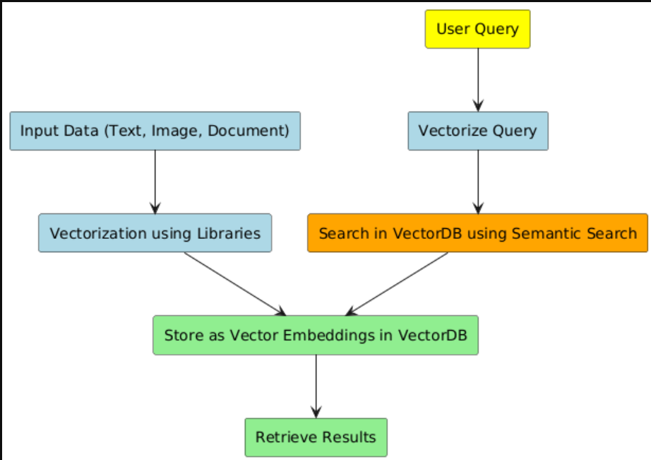

# Vector Database Exploration

This repository is dedicated to understanding and experimenting with vector databases (VectorDB) based on my personal learning journey. The content will cover various topics, providing explanations and practical implementations to help grasp the concepts and applications of VectorDB.

---

## Introduction to VectorDB

Vector databases are similar to traditional databases, but with a key difference in the way data is stored and retrieved. While traditional databases primarily deal with text and search operations are performed using indexes, VectorDBs can store diverse types of data (e.g., text, images, documents) as vector embeddings. This allows for efficient retrieval using semantic search.

### Key Concepts:
- **Vector Embeddings**: Numerical values representing data, used to find relations and directions between entities in multidimensional space.
- **Applications**:
  - Retrieval-Augmented Generation (RAG) applications
  - Recommendation engines

---

## Getting Started

### Installing ChromaDB
ChromaDB is a popular vector database that simplifies vector storage and retrieval. To install it, run:

```bash
pip install chromadb
```

---

## Day 1: Initial Setup and Querying

### File: `1.py`

#### Steps Covered:

1. **Creating an Instance**:
   - Start by creating an instance of the ChromaDB client.
   
2. **Creating a Collection**:
   - Use `get_or_create_collection()` to create or fetch an existing collection.
     - If a collection with the same name exists, it will be reused.
     - Alternatively, you can use `create_collection()` to always create a new collection.

3. **Uploading Data**:
   - Prepare your sample data and loop through it to upload each item.
   - Provide both `id` and the corresponding document for each entry.

4. **Querying the Collection**:
   - Perform a search using `collection.query()`.
   - Arguments:
     - **`query_texts`**: The search text for querying.
     - **`n_results`**: The number of results to retrieve, ordered by vector distance.

---

# Vector Database Exploration

This repository is dedicated to understanding and experimenting with vector databases (VectorDB) based on my personal learning journey. The content will cover various topics, providing explanations and practical implementations to help grasp the concepts and applications of VectorDB.

---

## Introduction to VectorDB

Vector databases are similar to traditional databases, but with a key difference in the way data is stored and retrieved. While traditional databases primarily deal with text and search operations are performed using indexes, VectorDBs can store diverse types of data (e.g., text, images, documents) as vector embeddings. This allows for efficient retrieval using semantic search.

### Key Concepts:
- **Vector Embeddings**: Numerical values representing data, used to find relations and directions between entities in multidimensional space.
- **Applications**:
  - Retrieval-Augmented Generation (RAG) applications
  - Recommendation engines

---

## Getting Started

### Installing ChromaDB
ChromaDB is a popular vector database that simplifies vector storage and retrieval. To install it, run:

```bash
pip install chromadb
```

---

## Day 2: Understanding Vector Embeddings

### What are Vector Embeddings?
Vector embeddings are numeric representations of data that capture certain features of the data. They are mathematical representations of objects in a continuous vector space, used to capture the semantic meaning or properties of these objects in a way that can be efficiently searched.

### How are Vector Embeddings Created?
Vector embeddings are generated using vector models such as `all-MiniLM-L6-v2`. These models are trained on datasets with input formats representing relationships between features or objects. These relationships act as directions in vector space, and distances between vectors are calculated to find the nearest ones.

### Calculating Distances
The distances between vectors are calculated using semantic search, which measures the similarity of vectors. Two primary methodologies are used:

1. **Cosine Similarity**:
   - Formula:
     \[
     \\text{Cosine Similarity} = \frac{A \cdot B}{||A|| ||B||}
     \]
     where \(A\) and \(B\) are vectors, and \(||A||\) and \(||B||\) are their magnitudes.

2. **Euclidean Distance**:
   - Formula:
     \[
     \\text{Euclidean Distance} = \sqrt{\sum_{i=1}^{n}(A_i - B_i)^2}
     \]
     where \(A_i\) and \(B_i\) are the components of vectors \(A\) and \(B\).

### Pipeline Flow
Here is how the process works:

1. **Input Processing**:
   - The input (text, image, document) is processed using vector libraries to generate vector embeddings.

2. **Storage**:
   - The vector embeddings are stored in the vector database.

3. **Search Operation**:
   - To perform a search, the user's query is vectorized, and the resulting vector is used to perform search operations in the database.

### Flow Diagram:



---

This is how vector embeddings and their operations are utilized in vector databases. 

### Next Steps:
On **Day 3**, we will explore persistent storage and open-source models for generating vector embeddings.

